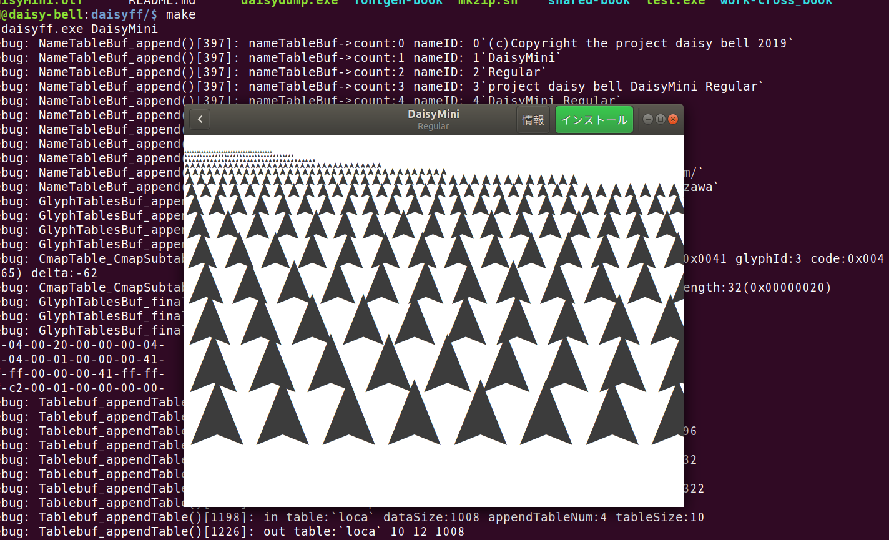

daisyf - minimal font generate trial
====

8ccおよびコンパイラ自作などに触発されたのだけれど、コンパイラを作るのは安直というかひねりが足りないリソースもない、というわけでフォーマットの学習がてら、フォントファイルをフルスクラッチで書くというのはどうか。  

# daisyf
##ミニマルゴール
以下のうちいずれかをミニマルゴールとする。  
- fileコマンドにFontと判定させる。  
- fontforgeで開ける。  
- afdko or fontTools で情報が読める。  
(すべて実現済み)  

## 現在実現していること
- 文字'A'を収録したTrueTypeフォントのバイナリファイル出力。  
 - (形状はAでなくてよい)  
 - 字形はハードコート。  
- 簡単なTrueTypeフォントバイナリlinter。  
 - afdko/ttfdump互換。  
 - ttfdumpよりも壊れたバイナリに強いが、今回必要だった最低限の内容しか実装していない。  

## ストレッチゴール
- OpenType(内部はTrueTypeでも可)でAの文字が収録されたフォント(形状はAでなくてよい)。  
- Windows OSのフォントビューアで開ける(OpenType, OS/2 Tableの実装が必要)  
- ベクタ描画情報ファイル(SVGとか?)から字形を読んでフォント化する。  

## 成果物
- 本GitHubリポジトリのソースコードとアプリケーション。  
- 技術同人書籍「[ゼロから作るTrueTypeフォント バイナリファイル]( https://daisy-bell.booth.pm/items/1314203 )」(技術書典6登場)。  

# App, toolchain, and source
フォント生成コマンドラインappや、OpenTypeデータ構造体などを含むヘッダ・ソース。  

## daisyff
OpenType(TrueType)フォントのバイナリファイルを出力するコマンドライン・アプリケーション。  

### run
`make`, `daisyff.exe $(FontName)`  

## daisydump
OpenType(TrueType)フォントのバイナリファイルを読み取って簡単にチェックしつつ標準出力する。  
afdko/ttfdumpの(少し気の利いた・最低限の機能しかない)クローン。  

気が利いているというのは簡単なフォーマットチェックをする・その際に不正なフォーマットのファイルで落ちにくい、よりセマンティックな(低数値の割り当て内容を文字列表記・表記の圧縮)表示。  
最低限の機能というのは、daisyffにて解析の必要だったTrueType必須Table, entriesしか実装していない。  

### run
`make dump`, `daisydump.exe $(FontFilePath)`  

# other
## license
MIT or BSD clause-2  

## contact
MichinariNukazawa / project daisy bell  

mail:		[michianri.nukazawa@gmail.com]( mailto:michianri.nukazawa@gmail.com )  
twitter:	[@MNukazawa]( https://twitter.com/MNukazawa )  
site:		[daisy-bell]( https://daisy-bell.booth.pm/ )  

